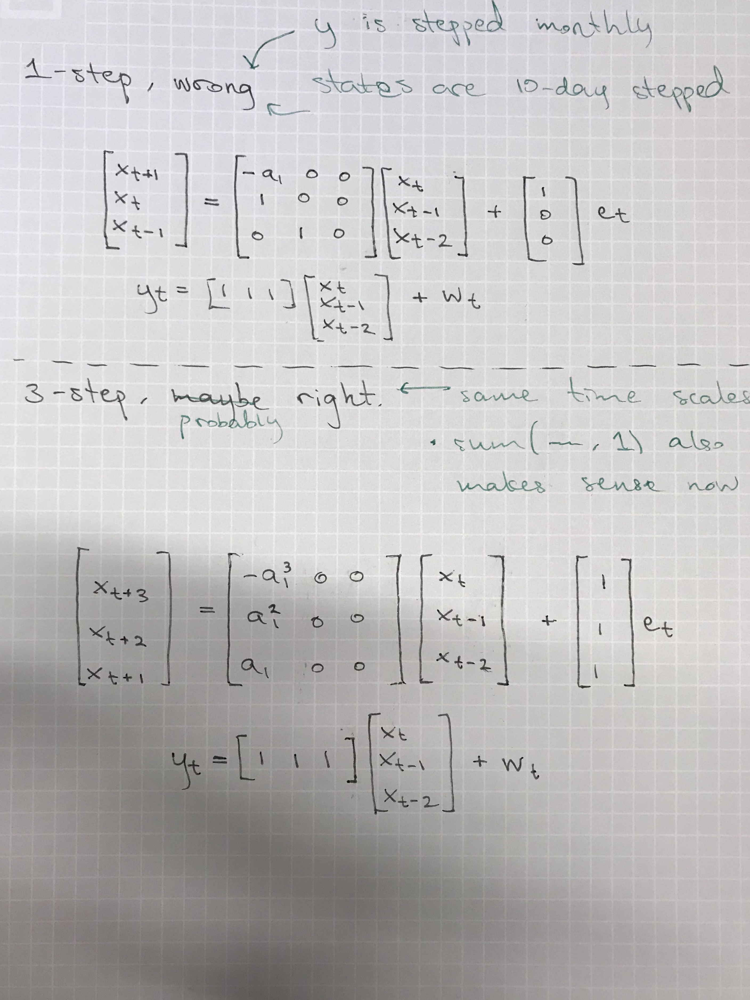

## Time Series Analysis - Autumn 2018

Project for our course in time series analysis.

  - The project examination will take place on 21/12, at 13-16, in MH:309A, or on 18/1, at 13-16, in MH:309A.  
    Choose either of these times; you cannot attend without being ready to present.
  - The project report and the presentation material should be handed in no later than at the start of the presentation.  
    Printed versions of the project report and the take home should be handed in to the course secretary.  
    The slides for the presentation may be mailed as a pdf to the lecturer directly.

### System Equation for the Kalman filter

